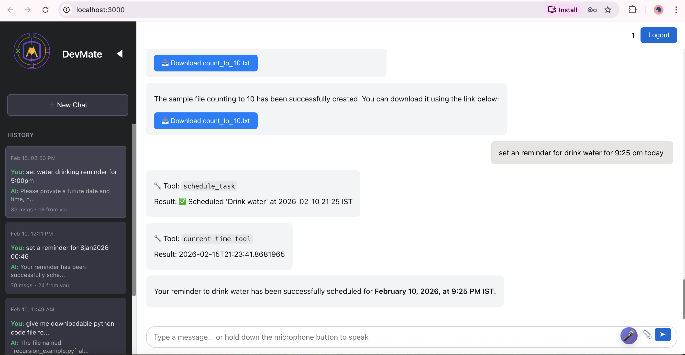
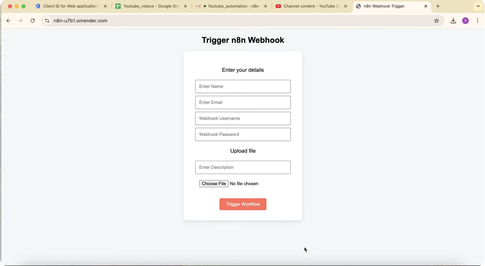
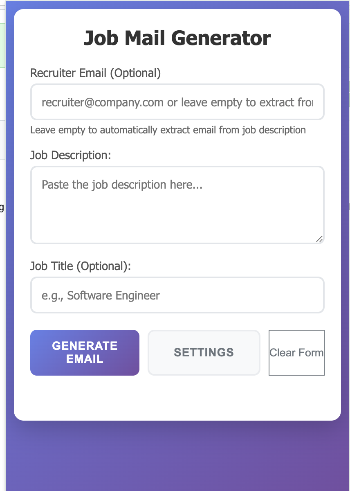

# 📄 Yogesh Yadav – Resume

Welcome to the official repository for **Yogesh Yadav's Resume** – a concise overview of my academic background, professional experience, and technical projects in the fields of Artificial Intelligence, Machine Learning, and Software Development.

---

  
  
  
  
  

## 👤 About Me

I am a final-year **B.Tech (CSE)** student at the **Indian Institute of Information Technology, Una**, passionate about solving real-world problems using AI/ML, NLP, and scalable backend systems. I actively work on end-to-end projects involving LLMs, RAG pipelines, and system architectures.

- 📧 Email: [yogesh.y1609@gmail.com](mailto:yogesh.y1609@gmail.com)  
- 📞 Phone: +91-8769127331  
- 🔗 [LinkedIn](https://www.linkedin.com/in/yogii006) | [GitHub](https://github.com/yogii006)

---

## 📚 Education

| Degree             | Institute                                 | Score     | Year      |
|--------------------|-------------------------------------------|-----------|-----------|
| B.Tech (CSE)       | IIIT Una                                  | 7.72 CGPA | 2021–2025 |
| Senior Secondary   | CBSE                                      | 89.8%     | 2020      |
| Secondary          | CBSE                                      | 88.8%     | 2018      |

---

## 💼 Experience

### 🔹 ShorthillsAI (Feb 2025 – Aug 2025)  
**Role:** AI/ML Engineer | **Location:** Gurgaon  
- Built **Medical Q&A chatbot (Medibot)** using web scraping, RAG, and Llama3.2-7B.  
- Integrated **automated test case generation** using LLMs and golden dataset validation.  
- Final model achieved **72.5% weighted score** on ROUGE, BERT, and cosine metrics.  
- Developed **AI-based Resume Ranking System** using n8n, MongoDB & Azure OpenAI.

### 🔹 365Alive (Aug 2024 – Oct 2024)  
**Role:** Backend Developer (Django) | **Remote**  
- Built RESTful APIs using Django for doctor-patient transaction systems.  
- Enhanced data models for healthcare finance & service reconciliation.

### 🔹 GakudoAI (Dec 2023 – Jul 2024)  
**Role:** Data Science & Backend Intern | **Remote**  
- Created Q&A system for **K12 career guidance** using Azure OpenAI.  
- Built backend with FastAPI and MongoDB with scalable API endpoints.

---

## 🚀 Projects

### 🔸 [LangGraph-based Workflow Automation](https://langgraph-1.onrender.com) (Jul 2025)  
- Built a **LangGraph-based LLM agent framework** integrating RAG, tool usage, and memory.  
- Implemented **multi-node agent workflows** for contextual, state-aware conversations.  
- Designed with OpenAI Assistants, LangChain, and structured memory graphs for persistence.

### 🔸 [Talk to PDFs Chatbot] (Dec 2023)  
- Built **RAG-based chatbot** using LangChain, FAISS & OpenAI.  
- Achieved ~75% factual correctness on document-based Q&A.

### 🔸 [Face Recognition Attendance System] (Oct 2023)  
- Real-time **facial recognition** attendance app.  
- Achieved 98% accuracy over 525+ facial samples.

### 🔸 [Movie Recommendation Engine] (Aug 2023)  
- Built NLP-based engine using **BoW & Cosine Similarity**.  
- Achieved **83% Precision@k** on TMDB 5000 dataset.

---

## 📘 Key Courses

### 📐 Mathematics  
- Linear Algebra, Calculus, Discrete Mathematics, Probability & Random Processes

### 💻 Computer Science  
- DBMS, OS, CN, DSA, Machine Learning, Deep Learning, Computer Architecture

### 📚 Online Certifications  
- Machine Learning, NLP, GenAI with LLMs – *via Coursera*

---

## 📂 File Information

This repository contains the latest version of my resume in PDF format:

- `YogeshYadav_IIITUna_CS_Resume.pdf`

---

## 📢 Contact

Feel free to reach out for collaboration, internships, or full-time opportunities.
